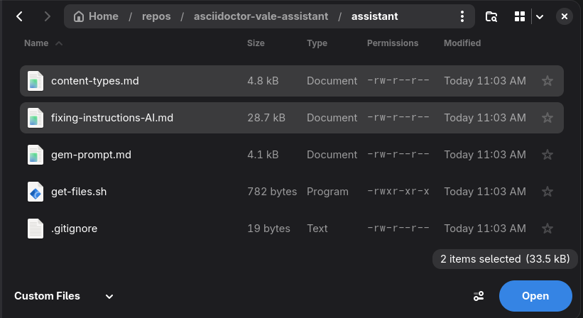

# asciidoctor-vale-assistant
Gemini-based assistant for fixing issues in AsciiDoc files flagged by [asciidoctor-dita-vale](https://github.com/jhradilek/asciidoctor-dita-vale).

You can use the assistant on any AsciiDoc file and its Vale report, and the assistant will offer explanations and suggest corrections. If you are working on fixing your files to ensure they are ready for DITA conversion, use the assistant as a "first line of support", before seeking help from the conversion team.

(You can also read the [fixing-instructions-AI.md](assistant/fixing-instructions-AI.md) file and use the instructions yourself, of course. The file is optimized for AI but still human-readable)

The assistant works as a "Gem", a custom instance of Gemini. Unfortunately, Gemini does not seem to offer a feature to share Gems with other users yet. Therefore, you must re-create the Gem as described here.

The Gem will not update automatically, so from time to time you might want to update the source files and then delete and re-create your Gem.

The procedures were tested on an enterprise Google account that includes paid Gemini Web.

## Re-creating the Gem

1. Clone this repository and change into its directory. Alternatively, if you already cloned this repository before, change to its directory and run `git pull`.
2. Run the following commands:
```
cd assistant
```
```
./get-files.sh
```
The script downloads additional files for your Gem.

3. Open [Gemini](https://gemini.google.com)
4. Click **Explore Gems**, then click the **+New Gem** button.


5. In the **Name** field, specify `Asciidoctor Vale correction`.
6. Under **Knowledge**, click the `+` button.
7. In the file selection dialog, navigate to the `assistant` subdirecgtory of this repository, and then select all the displayed files _except_ `gem-prompt.md` and `get-files.sh`.



8. Click **Open** to upload the files.
9. Open the `gem-prompt.md` file in a text editor, for example:
```
gedit gem-prompt.md
```
10. Select the entire content of the file and copy it into the clipboard, then paste into the **Instructions** field of the gem.


11. Click Save. The Gem now appears in your Gemini navigation menu.

## Getting assistance with a file

Use this tool to get assistance on a single file at a time. The assistant does not currently support working with many files at once.

We use `module.adoc` as the example name for your Asciidoc file.

1. Configure Vale as described in the documentation for [asciidoctor-dita-vale](https://github.com/jhradilek/asciidoctor-dita-vale).
2. Run Vale for the file and save the output:
```
vale module.adoc > module.vale.txt
```
3. Run the `nl` utility to addd line numbers to the file:
```
nl -ba module.adoc > module.adoc.numbered.txt
```
Note that in these steps the `.txt` extensuon is mandatory because Gemini does not permit uploading files with unsupported extensions such as `.adoc`.

4. Open [Gemini](https://gemini.google.com)
5. In the left-hand navigation menu, select your Gem, **Asciidoctor vale correction**.
6. In the prompt window, use the `+` button to upload the Vale output file (`module.vale.txt`) and the numbered version of the original file (`module.adoc.numbered.txt`).
7. Enter a brief prompt, for example, `Let's Go!`, and then press Enter.
The system outputs explanations and suggestions for the issues in your input.
